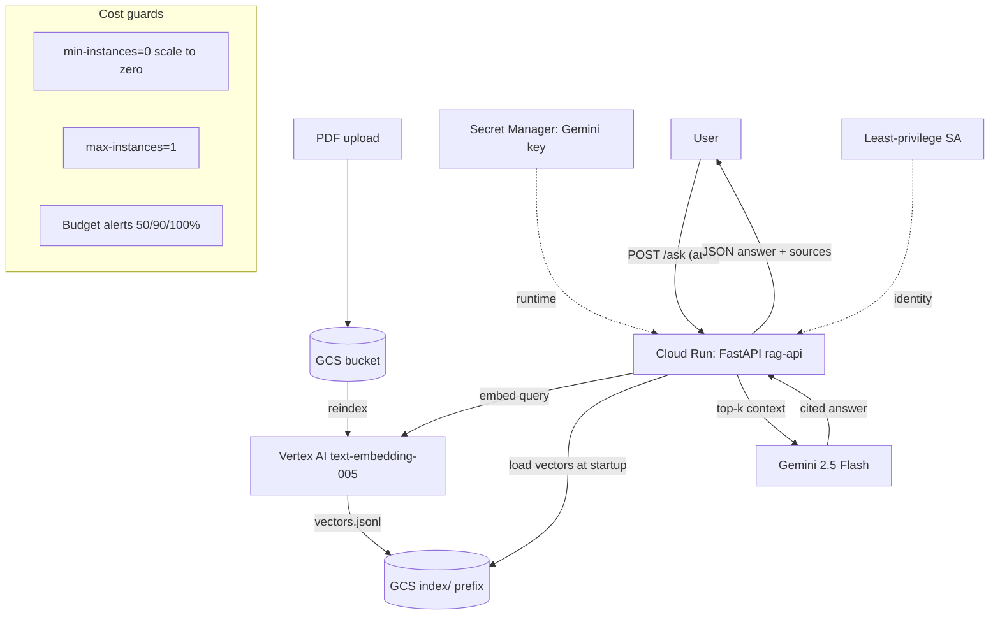

# rag-portfolio-v1

A production-style **Retrieval-Augmented Generation (RAG)** service on Google Cloud. Upload PDFs, ask questions, get answers grounded in the documents with inline citations. Built in small, shippable slices with strict cost controls.

> **Status:** Deployed and working. Built and operated on GCP (Cloud Run, Vertex AI, GCS, Secret Manager, Artifact Registry, Cloud Build, Eventarc). Total cloud spend to date: **under ₹15**, **₹0/month at idle** (scale-to-zero).

---

## What it does

1. PDFs live in a Cloud Storage bucket.
2. Text is extracted (`pypdf`) and split into overlapping chunks (recursive character splitter).
3. Each chunk is embedded with **Vertex AI `text-embedding-005`**; vectors are stored as JSONL in GCS.
4. A query is embedded and matched against the corpus by cosine similarity (in-memory NumPy).
5. The top-k chunks become context for **Gemini 2.5 Flash**, which answers using *only* that context and cites sources as `[file chunk N]`.
6. Exposed as a **FastAPI** service on **Cloud Run** (`/ask`, `/health`, `/reindex`).

---

## Architecture



**Region split (deliberate):** embeddings run in `asia-south1` (low latency from India); Gemini generation runs in `us-central1` (model availability). Inter-region Google traffic is free, so this costs nothing and trades ~150ms latency for reliability.

---

## Tech stack

| Layer | Choice |
|---|---|
| Language / deps | Python 3.12, `uv` |
| Embeddings | Vertex AI `text-embedding-005` |
| Generation | Gemini 2.5 Flash (AI Studio free tier default, Vertex fallback on 503) |
| Retrieval | In-memory cosine (NumPy) |
| API | FastAPI + Uvicorn |
| Container | Multi-stage Docker, built via Cloud Build |
| Hosting | Cloud Run (scale-to-zero, auth-only) |
| Storage | GCS (PDFs + vector index) |
| Secrets | Secret Manager (runtime injection) |
| Identity | Dedicated least-privilege service account |
| Events | Eventarc + GCS finalize (auto-reindex) |
| Tests | pytest (mocked unit suite) + live smoke test |

---

## Endpoints

| Method | Path | Purpose |
|---|---|---|
| GET | `/health` | Readiness check |
| POST | `/ask` | `{query, backend, k}` → answer + scored sources + token counts |
| POST | `/reindex` | Re-ingest corpus from GCS, re-embed, refresh index (idempotent; skips non-PDF and `index/` writes) |

Example response shape for `/ask`:

```json
{
  "query": "How many parameters does GPT-3 have?",
  "answer": "GPT-3 has 175.0 billion parameters [gpt3.pdf chunk 36, gpt3.pdf chunk 37].",
  "backend": "aistudio",
  "sources": [
    {"source": "gpt3.pdf", "chunk_id": 36, "score": 0.75}
  ],
  "tokens": {"in": 889, "out": 61}
}
```

---

## Run locally

```bash
uv sync
cp .env.example .env          # add your GEMINI_API_KEY
uv run python src/embed.py    # ingest from GCS + embed + write vectors to GCS
uv run python src/rag.py "What is multi-head attention?"
uv run python src/rag.py --vertex "What is multi-head attention?"
uv run pytest tests/ -q       # 11 unit tests, mocked, no API cost
```

---

## Deployment (summary)

```bash
# Build server-side (no local Docker push needed)
gcloud builds submit --tag <AR>/rag-api:v3 --timeout=20m

# Deploy with cost guards + secret + least-privilege SA
gcloud run deploy rag-api \
  --image=<AR>/rag-api:v3 --region=asia-south1 \
  --service-account=rag-run-sa@... \
  --set-secrets=GEMINI_API_KEY=gemini-api-key:latest \
  --min-instances=0 --max-instances=1 --memory=1Gi \
  --timeout=300 --no-allow-unauthenticated
```

The service is deployed and authenticated-only (no public access — calls require an identity token). Demoed via authenticated `curl` and the smoke test in `tests/smoke_test.sh`.

---

## Cost engineering

- **Scale-to-zero** (`min-instances=0`): no instances run when idle → ₹0/month at rest.
- **Capped** (`max-instances=1`): a runaway can't fan out.
- **Free-tier-first generation:** AI Studio free tier is the default; Vertex is a paid fallback used only on 503.
- **Budget alerts** at 50 / 90 / 100% of a ₹1000 cap, configured before any billable resource was created.
- **Secrets via Secret Manager**, never baked into images or committed.

**Total spend across the entire build: under ₹15** of a ₹28,365 free-trial credit.

---

## Event-driven ingestion — and an honest lesson

Auto-reindex on PDF upload was built with an **Eventarc** trigger on the GCS bucket's `OBJECT_FINALIZE` event, calling `/reindex`. **It works** — uploading a new paper automatically re-embedded the full corpus (proven: a freshly uploaded GPT-3 paper became queryable with correct citations minutes later, no manual steps).

**The lesson:** running the full re-embed *synchronously* inside the event handler exceeds Eventarc's acknowledgement deadline. Under Pub/Sub's at-least-once delivery, the unacknowledged event is **redelivered**, re-triggering the work — duplicate processing.

**The production-correct fix** (documented as the next iteration): the handler should acknowledge immediately and hand the work to a background queue (e.g. Cloud Tasks), with **idempotency keyed on the object generation** so duplicate deliveries become no-ops. The `/reindex` endpoint already includes a loop-guard (skips `index/` writes and non-PDF objects); the remaining work is the async-ack + dedup layer.

For now, reindexing runs via the **idempotent manual `/reindex` endpoint**, which is reliable and demoable. The trigger is disabled to avoid redundant re-embeds.

---

## Roadmap

- [x] GCP project, billing, budget alerts
- [x] GCS bucket + Artifact Registry
- [x] PDF ingestion + recursive chunking
- [x] Vertex AI embeddings + cosine retrieval
- [x] Gemini answer generation with citations + provider fallback
- [x] GCS-native ingestion
- [x] FastAPI service + multi-stage Docker
- [x] Cloud Run deployment (scale-to-zero, Secret Manager, least-privilege SA)
- [x] Unit test suite + live smoke test
- [x] Event-driven reindex (proven; async hardening pending)
- [ ] Async ack + idempotent reindex (Cloud Tasks)
- [ ] Terraform (infrastructure-as-code)
- [ ] CI/CD via GitHub Actions + Workload Identity Federation
- [ ] Retrieval evaluation (hit-rate@k on a labeled set)
- [ ] Migrate to unified `google-genai` SDK (legacy `vertexai` SDK sunsets 2026)

---

## Repo layout

```
src/
  ingest.py    # read PDFs from GCS, extract, chunk
  embed.py     # embed chunks, write vectors to GCS
  search.py    # load vectors from GCS, cosine retrieval
  rag.py       # retrieve + generate (AI Studio default, Vertex fallback)
  app.py       # FastAPI: /health, /ask, /reindex
tests/
  test_ingest.py, test_rag.py, test_app.py   # mocked unit tests
  smoke_test.sh                               # live auth'd test vs deployed service
Dockerfile     # multi-stage, slim runtime
```
